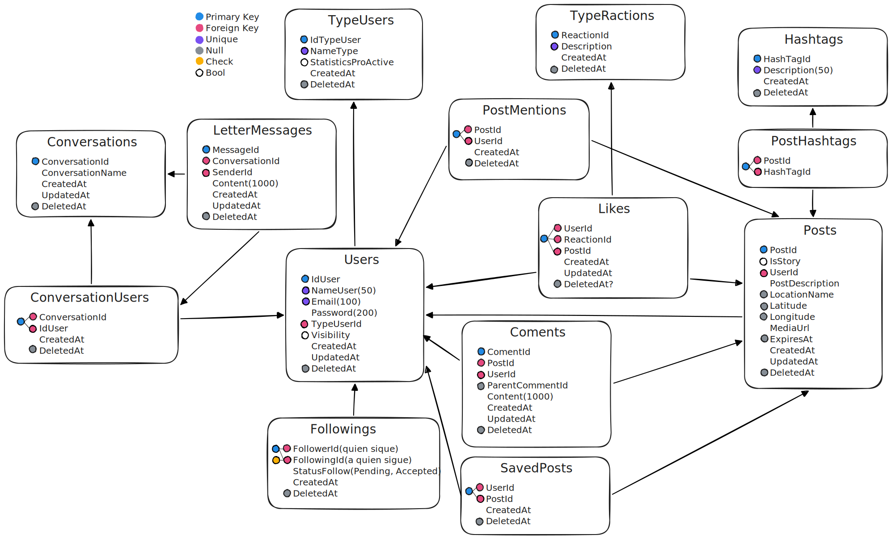

### Tabla de contenidos
- [Colaboradores](#colaboradores)
- [Construcción base de datos](#construccion)
- [Detalles Técnicos](#detalles)
- [Capturas](#capturas)
___
### Colaboradores
1.Freddy Barahona
2.Nury Aguilar

___
### construccion 

```
dotnet ef dbcontext scaffold "Server=localhost,1433;User=sa;Password=Admin1234@;
Database=InstagramClone;TrustServerCertificate=True" Microsoft.EntityFrameworkCore.SqlServer 
--project InstagramClone.Domain --startup-project InstagramClone.WebApi 
--context-dir Database/SqlServer/Context --output-dir Database/SqlServer/Entities --verbose
``` 
(si la creas por primera vez y no funciona quitale el `--no-build --force`, tambien el `--verbose` puedes obviarlo es para ver a que archivos entra el dbcontext es para ver errores)

___
### Detalles
```
builder.Services.AddScoped<IUserService, UserService>();
```
1. en el `InstagramClone.WebApi/program.cs` antes del comentario `//Database` esta el comando de arriba
    * builder.Services.AddScoped<IUserService, UserService>(); registra IUserService en el contenedor de inyección de dependencias de ASP.NET Core y establece que la implementación a instanciar es UserService.
    * El tiempo de vida es scoped: se crea una instancia nueva de UserService por cada petición HTTP y se comparte durante toda esa petición.
    * Cuando un controlador o servicio declara IUserService en su constructor, el framework le inyectará una instancia de UserService automáticamente.
    
2. en el `InstagramClone.WebApi/program.cs` antes de la construccion esta el comando 
```
builder.Services.AddSqlServer<InstagramCloneContext>(builder.Configuration.GetConnectionString("Database"));
```
* este comando registra el `DbContext InstagramCloneContext` en el contenedor de inyección de dependencias de ASP.NET Core y lo configura para usar SQL Server con la cadena de conexión llamada "Database" tomada de `appsettings.json` (o de otras fuentes de configuración).

    * `builder.Configuration.GetConnectionString("Database")` busca la clave ConnectionStrings:Database en appsettings.json o en otras fuentes de configuración.
___
### Capturas

